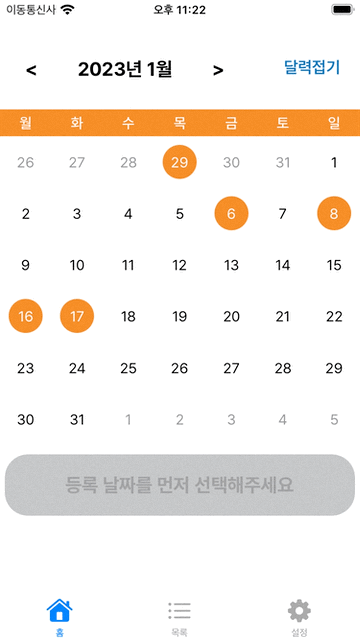
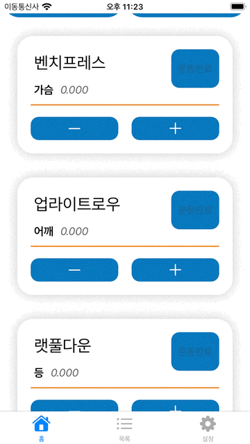
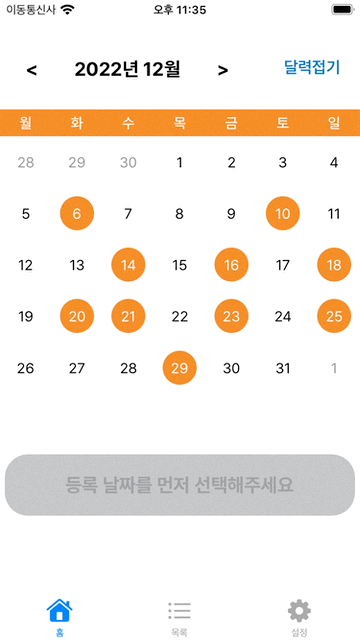

# 🏋️‍♀️ 득근득근 🏋️‍♀️

> 웨이트 운동을 수행하고, 날짜별로 수행한 운동을 기록하는 앱

# 앱 주요 기능 스크린샷
| 운동 루틴 등록 | 루틴 기록 및 수정 |
| - | - |
|||
| 달력 UI 스크롤 | 운동 목록 관리 |
| - | - |
||
- [앱스토어 "득근득근" 바로가기](https://apps.apple.com/kr/app/득근득근/id6444724818)
- 2022.12 앱스토어 ver1.0.0 배포

# 기술스택

- Swift, UIKit, CocoaPods, FirebaseAuth, Firebase Realtime Database

# 프로젝트 주요 포인트

- 앱 기획 / 제작 / 배포
- Calendar/Date 와 UICollectionView를 활용한 달력기능의 Custom UIComponent 구현
- Code-Based Autolayout
- User에 따른 데이터 읽기 / 등록 / 수정 / 삭제 관련 서버와의 통신 구현 (Codable 와 Firebase 활용)
- Sign in with Apple 및 3rd party를 통한 소셜로그인 및 Authentication 인증 과정 구현
